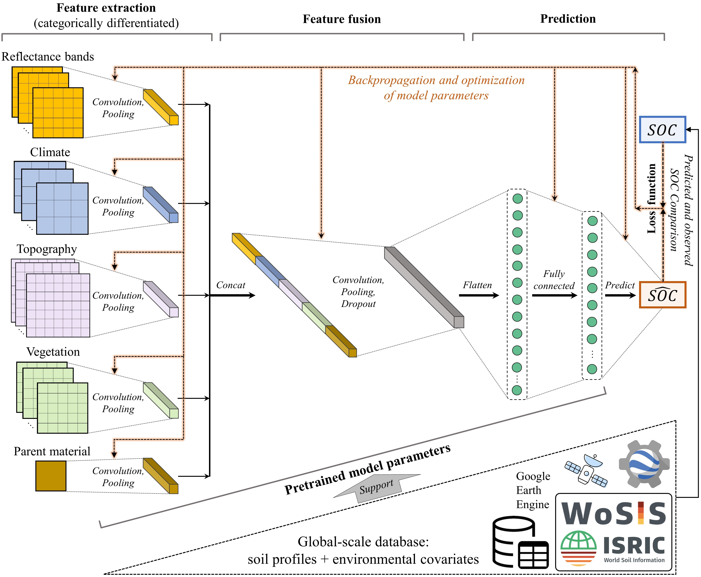
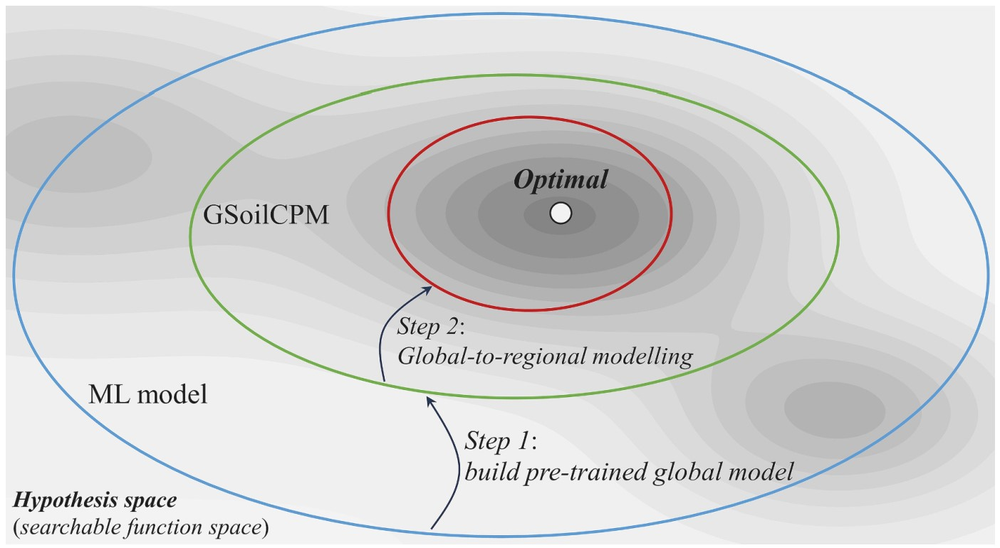

# GSoilCPM
This repository contains the code for the Global Soil Carbon Pre-trained Model (GSoilCPM) — a pre-trained global-scale foundation model for soil carbon prediction/mapping

More details can be found in the paper:

**Zhang, L.**, Yang, L., Ma, Y., Zhu, A.-X., Wei, R., Liu, J., Greve, M.H., Zhou, C., 2025. Regional-scale soil carbon predictions can be enhanced by transferring global-scale soil–environment relationships. ***Geoderma*** 461, 117466.
[https://doi.org/10.1016/j.geoderma.2025.117466](https://doi.org/10.1016/j.geoderma.2025.117466)

## Requirement
- Python3
- numpy
- pandas
- scikit-learn
- pytorch (torch version >= 2.4 CUDA version >= 11.8)

## Model structure
The Architecture of the Global Soil Carbon Pre-trained Model (GSoilCPM) is shown as the figure below. This foundation model for predicting soil organic carbon (SOC) is designed by using a deep learning framework with a structure that allows for differentiated processing environmental covariates influencing SOC based on soil formation theory. The model uses convolutional networks to extract the latent features from multiple 2-D covariate data for each input category separately, with adjustable window size to account for spatial context and resolution of inputs. These extracted features are concatenated together and processed through convolution and fully connected layers to extract their interactions, and then output the final predicted SOC. The global soil profile observations and remote sensing derived environmental covariates are collected as the global-scale database to support the training procedure of the model. The lighted arrow lines in orange represent that using backpropagation to optimize model parameters by minimizing the loss function generated from comparing the difference between predicted and observed SOC values.



## Global-to-regional modelling strategy
 **Why GSoilCPM offers an effective modelling strategy for regional soil predictions?** As illustrated in the figure below, the background color gradient represents the variation of model accuracy in the hypothesis space (a searchable space of the model function). The optimal location indicates the best model function. Building a pre-trained global model to capture the general soil–environment relationships can help narrow the scope of searching regional-scale predictive function. The global-to-regional modelling strategy can reduce the risk of falling into local minima when fitting a machine learning (ML) model based on region data alone.


## Description of directories and files
- **data (directory)**:
  Here the user needs to put the pickle files of the input data (X and y) for training the model. The requried data include:
    - The table file (e.g. csv format) of the sample data, this file should include columns of the sample location (longitude and latitude) and the value of target soil property, e.g. soil organic carbon values. We recommend that users use their own sample data, or use simulated data for testing. *Our sample dataset collected in this study is not publicly available but can be available from the author on reasonable request*.
    - The pickle files of input data (X) (e.g., reflectance bands, climate, topography, vegetation and parent material datasets with spatially contextual information).
- **config.py**: The configuration file for setting the data locations and model hyperparameters.
- **model (directory)**: The folder for storing the model.
- **utils.py**: It contains functions for the data loading and generating X and y as the inputs for model training and validating.
- **models.py**: The core functions for generating the GSoilCPM model for the soil prediction.
- **train_global.py**: It implements data preparation, model initialization and model training procedure for fitting the pre-trained model (GSoilCPM) based on the global soil and environmental datasets.
- **train_regional.py**: It implements data preparation, transferring the pre-trained model (GSoilCPM) and then fine-tuning the model based on the regional datasets.
- **pred.py**: For predicting the target values by using the saved model and evaluating the model performance on the validation set.

## Usage instructions

### Configuration

All model parameters can be set in `config.py`, such as the learning rate, batch size, number of layers, etc.

### Training the model

- Train GSoilCPM based on global soil and environmental datasets:
    ```python
    python train_global.py
    ```

- Tensorborad is supported for monitering the model performance during the optimization procedure.
    ```shell
    tensorboard ./log
    ```

- Then you can check the saved model structure and model parameters in the file `./model/pretrain_model/GSoilCPM.pth`

- Load the pre-trained model (GSoilCPM) (set the path of pre-trained model in `config.py`) and then fine-tune it on the regional data:
    ```python
    python train_regional.py
    ```


### Prediction and Evaluation

```python
python pred.py
```

The saved model can be loaded and evaluating on the test set.

## Data sources (environmental covariates)
- Climate: http://worldclim.org
- Global lithological database: https://doi.org/10.1594/PANGAEA.788537
- DEM: https://doi.org/10.5066/F7DF6PQS
- Geomorpho90m: https://doi.org/10.5069/G91R6NPX
- MODIS BRDF/Albedo and vegetation indices products: https://ladsweb.modaps.eosdis.nasa.gov

## License

The code and data shared in this <a xmlns:cc="http://creativecommons.org/ns#" xmlns:dct="http://purl.org/dc/terms/"><a property="dct:title" rel="cc:attributionURL" href="https://github.com/leizhang-geo/GSoilCPM.git">study</a> by <a rel="cc:attributionURL dct:creator" property="cc:attributionName" href="https://leizhang-geo.github.io">Lei Zhang</a> are licensed under <a href="http://creativecommons.org/licenses/by-nc/4.0/?ref=chooser-v1" target="_blank" rel="license noopener noreferrer" style="display:inline-block;">CC BY-NC 4.0</a></p>

## Contact

For questions and supports please contact the author: Lei Zhang 张磊 (lei.zhang@lbl.gov | lei.zhang.geo@outlook.com)

Lei Zhang's [Homepage](https://leizhang-geo.github.io/)
